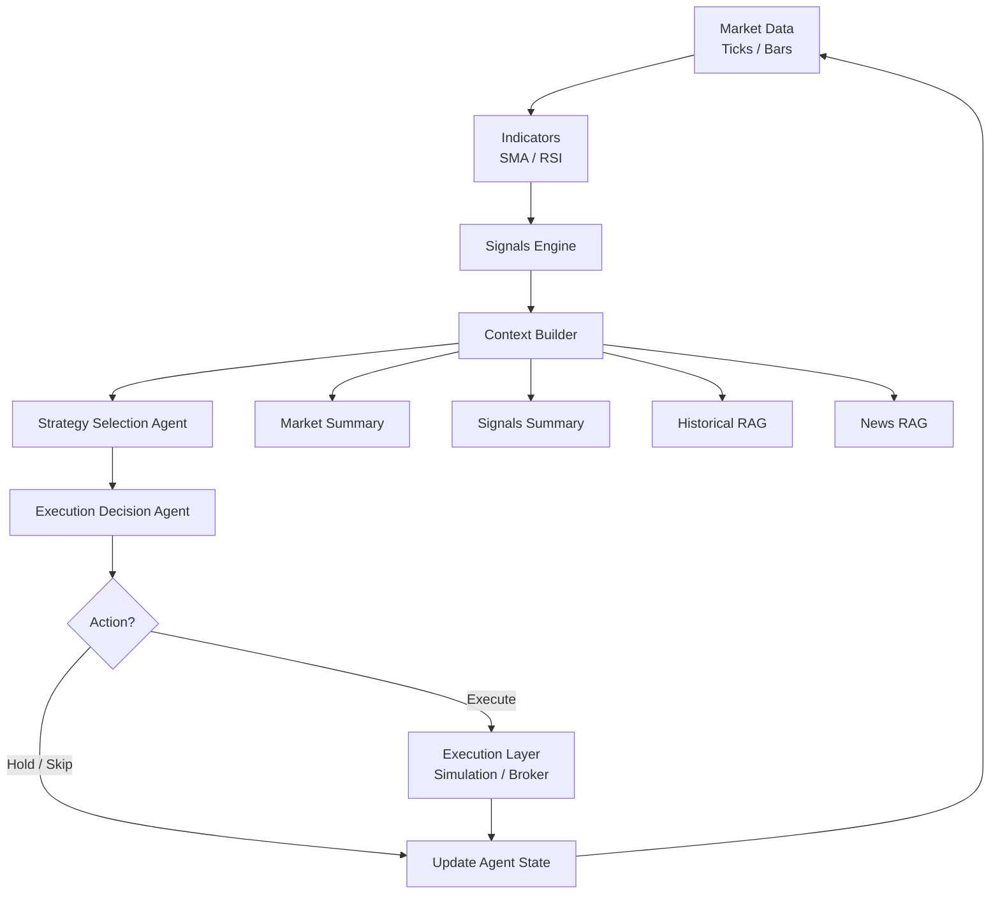

# Agentic Trading Workflow

Agentic Trading Workflow is an early-stage backend prototype for an autonomous trading workflow that turns market data, strategy signals, and retrieved context into agent-driven trading decisions.

## Project Goal

The goal of this project is to explore how a trading system can be organized around an agent loop instead of a single hard-coded strategy. The backend is designed to continuously receive or simulate market data, calculate indicators, generate strategy signals, build decision context from market summaries and RAG sources, then let AI agents choose a strategy and decide whether an order should be executed. At this stage, the project focuses on validating the workflow structure and core interfaces before connecting real broker execution, production data pipelines, and more advanced decision logic.

## Workflow Diagram

