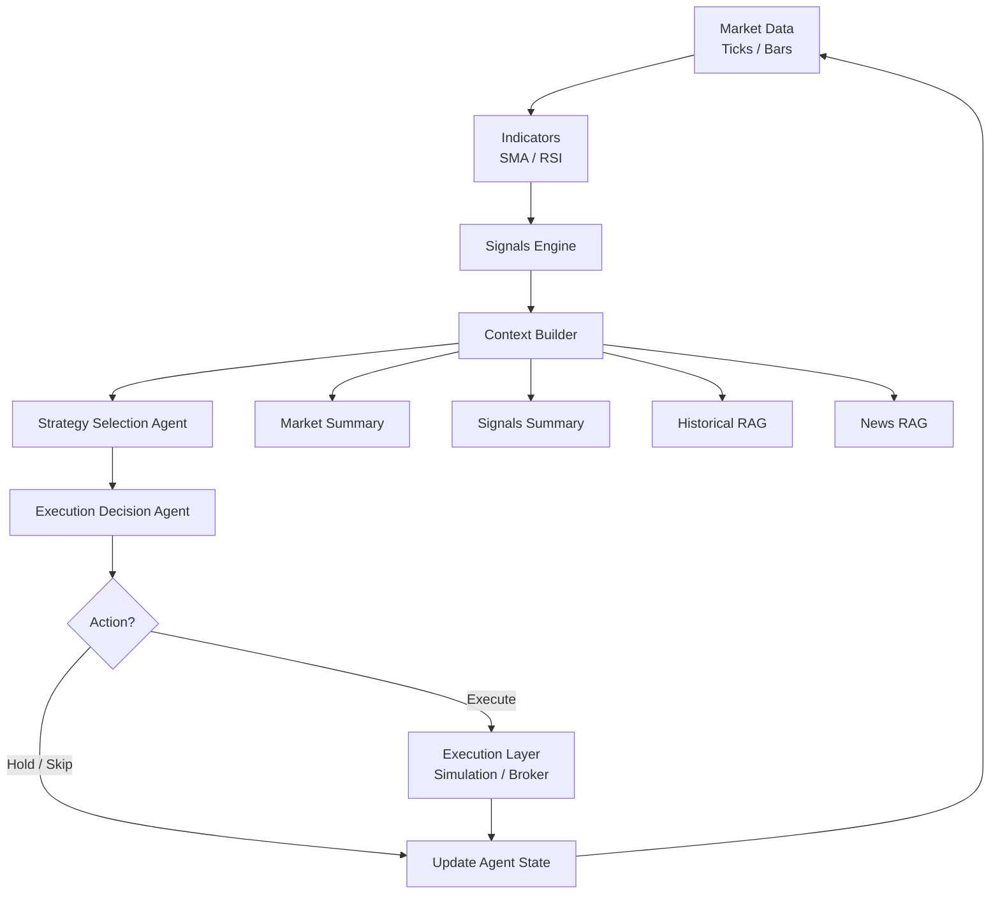

# Agentic Trading Workflow


Agentic Trading Workflow is an early-stage backend prototype for an autonomous trading workflow that turns market data, strategy signals, and retrieved context into agent-driven trading decisions. The backend now includes a minimal Interactive Brokers Gateway/TWS connection path that can read market updates from a local IB paper trading session and persist them for later execution, risk, and analysis work.

## Project Goal

The goal of this project is to explore how a trading system can be organized around an agent loop instead of a single hard-coded strategy. The backend is designed to receive market data, calculate indicators from bar data, generate strategy signals, build decision context from market summaries and RAG sources, then let AI agents choose a strategy and decide whether an order should be executed. At this stage, the project focuses on validating the workflow structure and core interfaces before connecting real broker execution, production data pipelines, and more advanced decision logic.

## Current IB Data Integration

The current market data path connects to a local Interactive Brokers TWS or IB Gateway instance using `ib_insync`.

Because this demo does not assume paid real-time market data subscriptions, the backend currently requests delayed market data with `reqMarketDataType(3)` and streams quote updates through `reqMktData`. These updates are normalized into tick-like records, cached as the latest market snapshot, and written to SQLite. 

## Run Locally

Start TWS or IB Gateway, log into the paper account, and enable API socket clients with port `7497`. Then run:

```bash
uvicorn app.main:app
```

Open:

```text
http://127.0.0.1:8000
```

## Workflow Diagram




